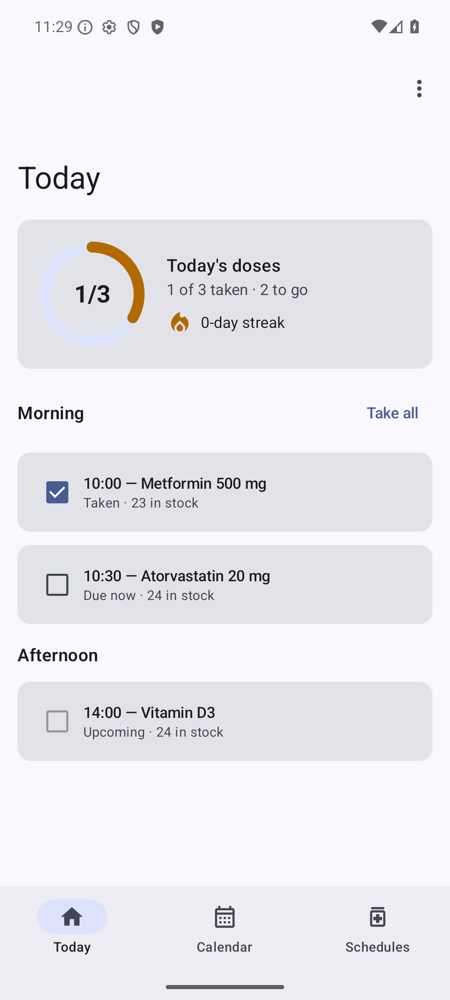
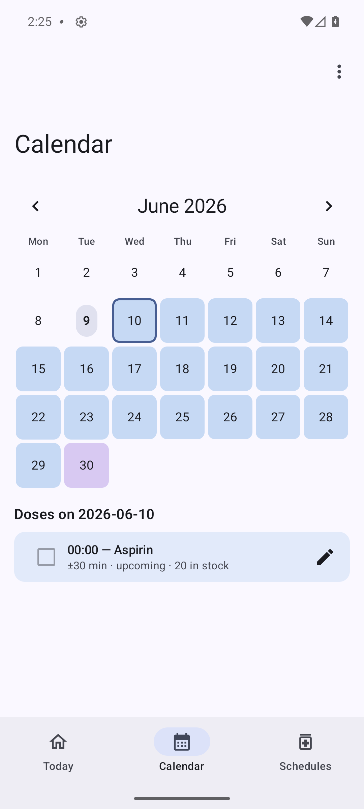
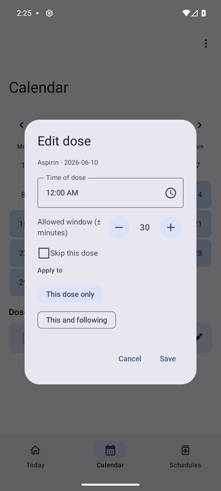
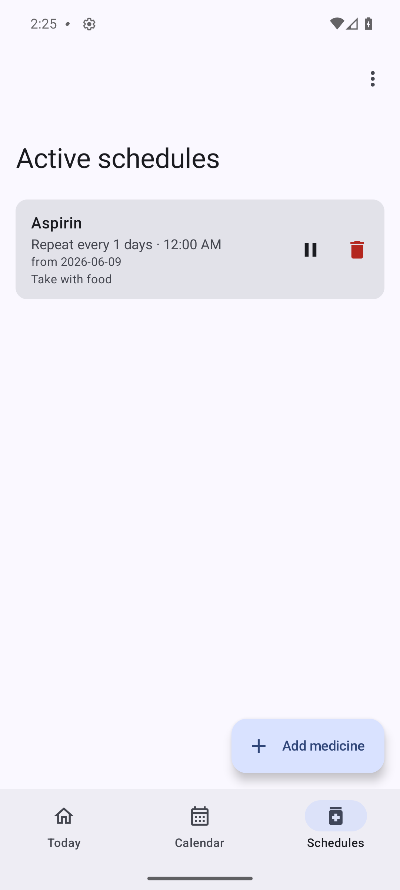

# MedAboutYou — Android

**Search Europe's medicine databases and run your whole medication schedule —
privately, on your device.**

An Android (Kotlin · Jetpack Compose · Material 3) port of the GTK4 desktop
**MedAboutYou**. It searches the **European Medicines Agency (EMA)** and **Italian
AIFA** databases and shows full medicine records, and it is a complete
**medication manager**: recurring dose schedules, dose logging, reminder
notifications, adherence analytics and refill/stock forecasting.

| Field | Value |
|-------|-------|
| Version | 0.3.0 |
| App ID | `com.uallsi.medaboutyou` |
| Platform | Android 8.0+ (minSdk 26), target/compile SDK 35 |
| Stack | Kotlin 2.1, Compose (Material 3), Room, WorkManager, OkHttp, kotlinx.serialization, Coroutines, Coil |

> **Privacy first.** Your schedules, dose log and stock live in a local SQLite
> (Room) database and **never leave the device**. The only network use is the EMA
> dataset download, AIFA live search and a best-effort Wikipedia image lookup. The
> one optional off-device action is an SMS to caregivers you add yourself — off by
> default.

<p align="center">
  
  
  
  
</p>

## Features

- 🔎 **Find a medicine** — search EMA (cached on-device for offline browsing) or
  AIFA (live); rich records with indication, classification, authorisation, type
  badges and the official EPAR/RCP link.
- 🗓️ **Schedule any therapy** — hourly, daily, weekly (multi-day), monthly,
  yearly or one-shot; several times per day; end on a date, after N doses, or
  ongoing.
- 🏠 **Today** — adherence ring, a time-of-day dose timeline, a refill banner and
  one-tap **Take all**.
- 📅 **Calendar** — a colour-coded month grid and a daily agenda; **edit, retime
  or skip a single dose**, or change *this and all following* doses.
- 💊 **Schedules** — pause/resume a therapy (timed or indefinite), edit it from
  today on, or cancel it (history is kept, never deleted); per-schedule notes.
- 📈 **Insights** — 7/30/90-day adherence, current streak, a 30-day heatmap,
  per-medicine bars and upcoming refills.
- ⏰ **Reminders** — exact-alarm notifications with Take/Skip actions, plus an
  optional **caregiver SMS** escalation for overdue doses.
- 📦 **Stock & refills** — top up by real marketed pack sizes; the app forecasts
  when each medicine runs out.
- 🌍 **5 languages** (en/it/fr/es/de), Material You dynamic colour, an adaptive
  bottom-bar / nav-rail layout, light & dark.

## Navigation at a glance

Three bottom tabs — **Today · Calendar · Schedules** — with **Search** reached
from the Schedules "Add medicine" button, and **Insights** / **Settings** in the
top-bar overflow (⋮).

## Build & run

```bash
export JAVA_HOME=/opt/android-studio/jbr      # JDK 21 (bundled with Android Studio)
export ANDROID_HOME=$HOME/Android/Sdk
./gradlew :app:assembleDebug                  # → app/build/outputs/apk/debug/app-debug.apk
./gradlew installDebug                         # install on a running device/emulator
```

Gradle 8.13 / AGP 8.9.3, built with the Studio-bundled JBR.

## Testing

```bash
./gradlew :app:testDebugUnitTest          # JVM domain tests
./gradlew :app:lintDebug                  # Android Lint — 0 errors
./gradlew :app:connectedDebugAndroidTest  # Room + Compose UI tests (needs a device/emulator)
```

## Documentation, presentations & website

| Resource | Purpose |
|---|---|
| [User Guide](docs/USER_GUIDE.md) | Every screen and flow, step by step |
| [Technical Documentation](docs/TECHNICAL.md) | Architecture, data model, schema, testing (PlantUML diagrams) |
| [Overview deck](docs/presentation-overview.html) | What the app is and how it's built — open in a browser |
| [How-to deck](docs/presentation-howto.html) | A guided tour of using the app |
| [Website](website/index.html) | Landing page with **Download latest APK** |

See [CLAUDE.md](CLAUDE.md) for the architecture and the porting rules that keep the
domain logic in parity with the immutable C++ reference.

## Disclaimer

MedAboutYou is an **information and adherence aid, not medical advice** — always
follow your prescriber and the official product information.

## License

[GNU Affero General Public License v3.0 or later](LICENSE) (`AGPL-3.0-or-later`) ·
© 2026 Umberto Allievi.

This program is free software: you can redistribute it and/or modify it under the
terms of the GNU Affero General Public License as published by the Free Software
Foundation, either version 3 of the License, or (at your option) any later version.
It is distributed in the hope that it will be useful, but **without any warranty**.
See the [LICENSE](LICENSE) file for the full text.
