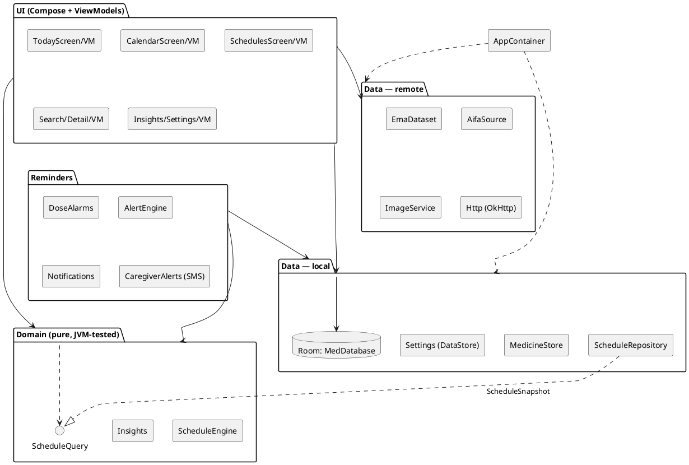
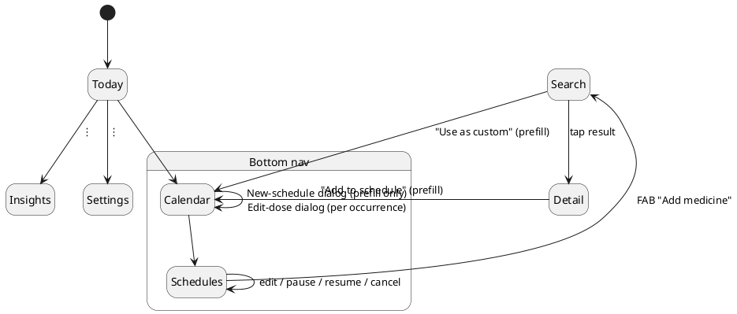
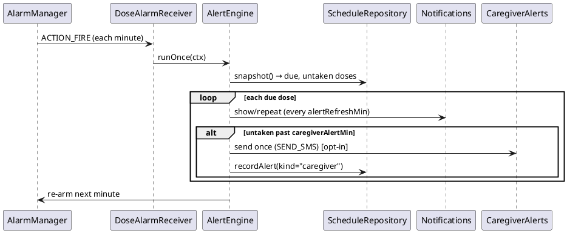
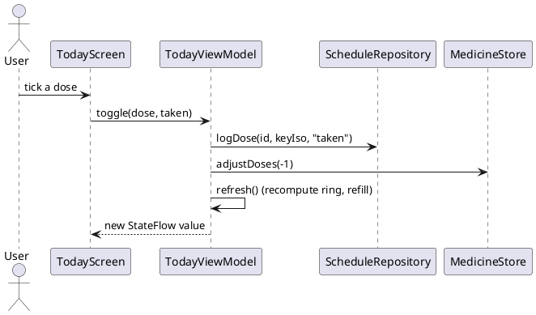

# MedAboutYou — Technical Documentation

Engineering reference for the Android app: architecture, domain model, data
layer, schema/migrations, reminders, concurrency, i18n and testing. Diagrams are
PlantUML (workspace convention) — paste any block into a PlantUML renderer.

- **App ID:** `com.uallsi.medaboutyou` · **Version:** 0.2.0 (DB schema v6)
- **Platform:** Android 8.0+ (minSdk 26), target/compile SDK 35
- **Language/UI:** Kotlin 2.1.10, Jetpack Compose (Material 3)
- **Origin:** a faithful port of the GTK4/libadwaita desktop *MedAboutYou*; the
  domain layer is ported function-for-function and unit-tested for parity.

---

## 1. Principles

- **Local-only data.** Schedules, dose log, overrides and stock live in one
  on-device SQLite (Room) database. The *only* network calls are EMA dataset
  download, AIFA live search and a Wikipedia image lookup. The *only* off-device
  egress is an opt-in caregiver SMS (`SEND_SMS`), off by default.
- **Append-only history.** Schedules, the dose log and per-occurrence overrides
  are never deleted. Cancel is a soft `active = 0`; an edit "from now" ends the
  original yesterday and starts a new row, so past adherence is never rewritten.
- **Pure, testable domain.** `model/` and `domain/` have **no Android
  dependency** and run on the JVM. The DB is read into an immutable
  `ScheduleSnapshot` so analytics never suspend mid-loop.

---

## 2. Tech stack

| Concern | Choice |
|---|---|
| UI | Jetpack Compose, Material 3, `NavigationSuiteScaffold` (adaptive) |
| Async | Kotlin Coroutines + `StateFlow`; IO on `Dispatchers.IO` |
| Persistence | Room (SQLite); Preferences DataStore for settings |
| Networking | OkHttp + kotlinx.serialization (JSON) |
| Images | Coil |
| Background | `AlarmManager` exact alarms + WorkManager fallback |
| DI | Hand-rolled service locator (`AppContainer`) |
| Build | Gradle 8.13, AGP 8.9.3, JDK 21 (Studio JBR) |

---

## 3. Architecture (layers)



`MedApp` (the `Application`) owns a single `AppContainer` service locator;
`AppViewModelFactory` wires every screen ViewModel to it.

---

## 4. Navigation model

Three bottom destinations; Search/Insights/Settings are sub-pages; Detail is an
immersive full-screen route. New schedules are created from a medicine record,
which navigates to Calendar with a one-shot prefill that auto-opens the dialog.



---

## 5. Package map

| Package | Responsibility |
|---|---|
| `model/` | `Medicine`, `Pack`, `Source`; `Schedule`, `DoseTime`, `Occurrence`, `PeriodUnit`, `EndMode`; **`ScheduleEngine`** (occurrence generation) |
| `domain/` | **`Insights`** analytics; `ScheduleQuery` interface; `Now` |
| `data/local/` | Room `MedDatabase`, `Entities`, `Daos`, `Mappers`; `MedicineStore`, `ScheduleRepository` (+ `ScheduleSnapshot`); `Settings` (DataStore) |
| `data/remote/` | `Http`, `EmaDataset`, `AifaSource`, `ImageService` |
| `reminders/` | `DoseAlarms`, `DoseAlarmReceiver`, `AlertEngine`, `Notifications`, `DoseActionReceiver`, `CaregiverAlerts`, `BootReceiver`, `ReminderWorker` |
| `ui/` | `today/ calendar/ schedules/ search/ detail/ dashboard/ settings/`; `common/` (pickers, steppers, badges), `theme/`; `AppRoot`, `Selection`, `ViewModels` |
| `widget/` | `TodayWidgetProvider`, `TodayWidgetService` (home-screen "today's doses") |

---

## 6. Domain model

```plantuml
@startuml
skinparam classAttributeIconSize 0
enum Source { EMA; AIFA }
enum PeriodUnit { ONCE; HOURS; DAYS; WEEKS; MONTHS; YEARS }
enum EndMode { NEVER; DATE; COUNT }

class Medicine {
  source: Source
  extId, name, inn, activeSubstance
  atcCode, therapeuticIndication
  badges: Boolean...
  rcpUrl, url
  packs: List<Pack>
}
class Pack { label: String; units: Int }

class Schedule {
  id: Long
  medSource, medExtId, medName
  startDate; endMode; endDate; doseCount
  periodUnit; periodN
  times: List<DoseTime>
  windowMinutes
  suspended; suspendedUntil
  caregiverAlertMin; alertRefreshMin
  notes; active
}
class DoseTime { year; month; dayOfMonth; weekday; hour; minute }
class Occurrence {
  scheduleId; medName
  year; month; day; hour; minute
  windowMinutes; index
  status; keyIso
}
class ScheduleEngine <<object>> {
  +occurrencesOn(s, y, m, d): List<Occurrence>
  +isPastDateTime(...): Boolean
  +isWithinTakeWindow(..., window): Boolean
}

Medicine "1" o-- "*" Pack
Schedule "1" o-- "*" DoseTime
Schedule ..> PeriodUnit
Schedule ..> EndMode
Schedule ..> Source
ScheduleEngine ..> Schedule
ScheduleEngine ..> Occurrence
@enduml
```

### 6.1 `ScheduleEngine` semantics

`occurrencesOn(schedule, y, m, d)` returns the doses that fall on a date. Semantics
by unit (each `DoseTime` carries the fields its unit needs):

| Unit | Fires |
|------|-------|
| `ONCE` | each entry's own full date/time (ignores start/interval) |
| `HOURS` | every *N* hours from the start-date midnight, at each entry's **minute** |
| `DAYS` | every *N* days, at each entry's **time** |
| `WEEKS` | the entry's **weekday**, every *N* weeks, at its time |
| `MONTHS` | the entry's **day-of-month** (clamped to month length), every *N* months |
| `YEARS` | the entry's **month + day** (Feb-29 blocked), every *N* years |

`COUNT` end-mode uses a **bounded ordered generator** (capped at `doseCount`) so the
global dose index is stable; `NEVER`/`DATE` compute the day directly. Day-31 in a
short month clamps to the last existing day.

**Take window** (added for early ticking): `isWithinTakeWindow(...,window)` is true
once `now ≥ scheduled − windowMinutes`, so the UI enables a dose's checkbox from the
opening of its window; `isPastDateTime(...)` (now ≥ scheduled) still drives the
missed/due/upcoming status colours.

### 6.2 `Insights`

Ports the desktop `insights.cpp` exactly: `adherence(7/30/90)`, `currentStreak`,
`adherenceByMedicine`, `dailyAdherence` (heatmap), `forecastRunouts` /
`refillForecast` over a 366-day horizon. It reads stock through a `DosesAvailable`
lambda, never the DB directly, and runs against a `ScheduleSnapshot`
(`ScheduleQuery`) so it stays pure and synchronous. `medKey` uses the desktop's
`` `-separated `` layout for stock identity.

---

## 7. Data layer & schema

### 7.1 Entity–relationship

```plantuml
@startuml
hide circle
skinparam linetype ortho
entity medicines {
  * source : TEXT <<PK>>
  * ext_id : TEXT <<PK>>
  --
  name, inn, active_substance, atc_code
  therapeutic_indication, ma_holder
  has_rcp, rcp_url, url, ... (badges, dates)
  species  (legacy, unused)
}
entity meta { * key : TEXT <<PK>>\n-- value }
entity inventory { * med_key : TEXT <<PK>>\n-- doses : INT }
entity schedules {
  * id : INTEGER <<PK auto>>
  --
  med_source, med_ext_id, med_name
  start_date, end_mode, end_date, dose_count
  period_unit, period_n, hour, minute, times
  window_minutes, suspended, suspended_until
  caregiver_alert_min, alert_refresh_min
  notes, active, created_at, updated_at
}
entity dose_log {
  * id <<PK>>
  schedule_id, scheduled_at (key_iso)
  status, logged_at
}
entity occ_override {
  * id <<PK>>
  schedule_id, scheduled_at (key_iso)
  hour, minute, window_minutes, cancelled, updated_at
}
entity dose_alert {
  * id <<PK>>
  schedule_id, scheduled_at, kind, sent_at
}
schedules ||--o{ dose_log : schedule_id
schedules ||--o{ occ_override : schedule_id
schedules ||--o{ dose_alert : schedule_id
@enduml
```

Relationships are **logical** (joined in code by `schedule_id`), not enforced FKs.
Stock identity (`inventory.med_key`) is `"<source>:<extId>"`, or `"name:<lower>"`
for custom medicines — identical to the desktop `med_key`.

### 7.2 Repositories

- **`ScheduleRepository`** — `create`, `cancel` (soft), `setPause`, `updateEnd`,
  `editFromNow` (split-from-today edit), `editSingle` (per-occurrence override),
  `splitFrom` (this-and-following), `logDose`, alert bookkeeping, and `snapshot()`
  which builds an immutable **`ScheduleSnapshot`** (all schedules + their overrides
  + logs) implementing `ScheduleQuery` for synchronous analytics. The override/log
  key is the occurrence's **original** time (`keyIso`), stable across retimes.
- **`MedicineStore`** — cached EMA records (`search`, `count`, `upsertAll`), the
  `meta` block, and inventory (`availableDoses`, `setDoses`, `adjustDoses`, clamped
  ≥ 0). Taking a dose calls `adjustDoses(-1)`; untaking `+1`; scheduling never
  touches stock.

### 7.3 Migrations

`exportSchema = false`; migrations are explicit and additive.

| From → To | Change |
|---|---|
| 1 → 2 | add `schedules.times` (serialised `DoseTime` list) |
| 2 → 3 | add `caregiver_alert_min`, `alert_refresh_min`; create `dose_alert` |
| 3 → 4 | add `schedules.suspended` |
| 4 → 5 | add `schedules.suspended_until` |
| **5 → 6** | **drop the unused `image_cache` table** |

The `medicines.species` column is retained but unused (kept out of the domain
model; left in the table so the re-downloadable cache needs no destructive
migration). `DoseTime`s serialise as `;`-separated `y:m:d:weekday:h:m` entries.

---

## 8. Reminders & alerts

Exact-alarm driven (not WorkManager-period). A self-rescheduling `AlarmManager`
exact alarm fires on the minute; `AlertEngine.runOnce` decides what to do.



- `Notifications` posts the reminder with **Take** / **Skip** actions handled by
  `DoseActionReceiver` (which logs the dose and re-evaluates).
- The 15-minute **WorkManager `ReminderWorker`** is only a fallback that re-arms
  the alarm; the exact alarm doesn't survive reboot, so `BootReceiver`/`MedApp`
  re-arm it. Any mutation calls `DoseAlarms.kickNow` to re-evaluate immediately.
- The home-screen **widget** is refreshed on each alert pass.

---

## 9. Concurrency

The desktop's `jthread` + `dispatch_to_ui` + generation-counter pattern maps to
coroutines: each ViewModel runs IO on `Dispatchers.IO` and exposes `StateFlow`
collected with `collectAsStateWithLifecycle`. Rapid inputs (search keystrokes)
**cancel the prior job** (`searchJob?.cancel()`) — the coroutine equivalent of the
generation guard. Analytics run against the synchronous `ScheduleSnapshot`.

### Dose-logging flow



---

## 10. Settings, i18n & theming

- **Settings** persist in a Preferences **DataStore** (`source`, reminders on/off,
  start-at-boot, vet-included, user name, caregivers).
- **i18n:** strings in `values/` + `values-it/ -fr/ -es/ -de/`; in-app language
  switch via `AppCompatDelegate.setApplicationLocales`.
- **Theme:** Material 3 with **Material You dynamic colour** (Android 12+),
  falling back to a teal brand palette (`#1A6F5B`); semantic status colours live in
  `MedColors` (`ui/theme/Theme.kt`).

---

## 11. Testing

| Layer | Where | Run |
|---|---|---|
| Domain (pure) | `app/src/test/` — `InsightsTest`, `MedicineParsingTest`, `TakeWindowTest` | `./gradlew :app:testDebugUnitTest` |
| Static analysis | Android Lint + Slack Compose | `./gradlew :app:lintDebug` (0 errors) |
| Room + Compose UI | `app/src/androidTest/` — `ScheduleRepositoryInstrumentedTest`, `TodayScreenUiTest`, `RefillFlowTest`, `FullUsageTest`, `NewFeaturesUiTest` | `./gradlew :app:connectedDebugAndroidTest` |

Notes:
- `FullUsageTest`, `RefillFlowTest`, `NewFeaturesUiTest` run against the **real**
  persistent DB and require clean state — run each with
  `adb shell pm clear com.uallsi.medaboutyou` between classes (they each seed and
  assert exact app state).
- `ScheduleRepositoryInstrumentedTest` uses an in-memory Room DB.
- Headless emulator:
  `emulator -avd Pixel_API_36 -no-window -no-snapshot -gpu swiftshader_indirect`,
  then `adb wait-for-device`.
- Run one class: `adb shell am instrument -w -e class <FQN> com.uallsi.medaboutyou.test/androidx.test.runner.AndroidJUnitRunner`.

When changing domain behaviour, keep `InsightsTest`/`TakeWindowTest` green.

---

## 12. Build & release

```bash
export JAVA_HOME=/opt/android-studio/jbr   # JDK 21
export ANDROID_HOME=$HOME/Android/Sdk
./gradlew :app:assembleDebug               # debug APK
./gradlew :app:assembleRelease             # release (configure signing first)
```

`local.properties` must point `sdk.dir` at the SDK. The debug build is what the
[website](../website/index.html) currently serves; for distribution, configure a
release signing config and ship `assembleRelease`.

---

## 13. Egress summary (privacy audit)

| Egress | When | Toggle |
|---|---|---|
| EMA dataset download | first EMA search / refresh | implicit |
| AIFA live search | each AIFA query | implicit |
| Wikipedia image | viewing a record | best-effort |
| **Caregiver SMS** | a dose overdue past the delay | **opt-in, off by default** |

No analytics, no telemetry, no account, no cloud sync. Schedules, dose log,
overrides and stock never leave the device.
